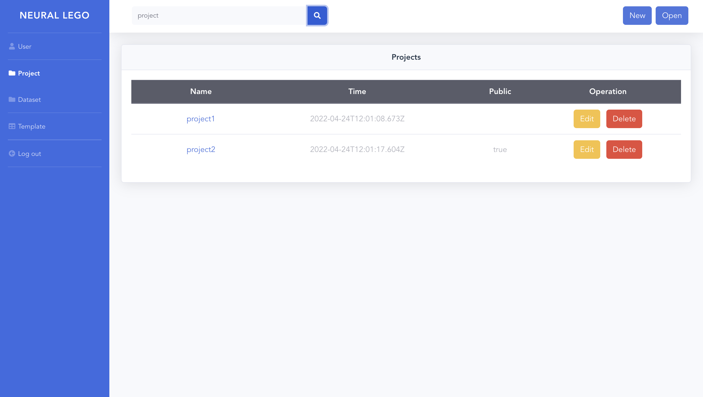
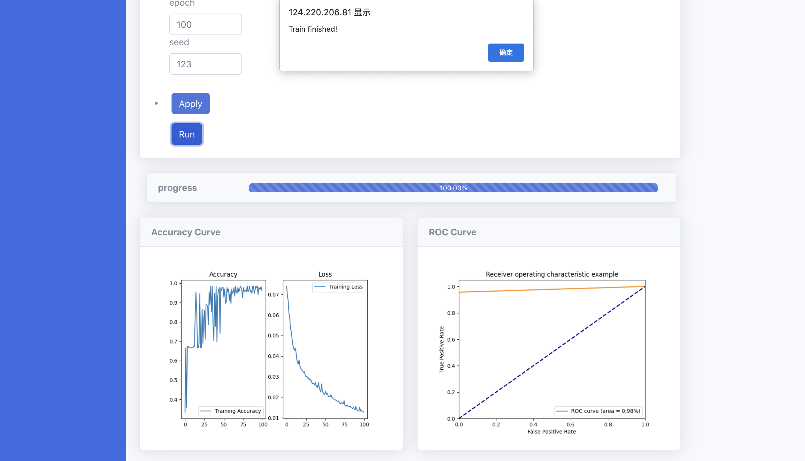

# Neural Lego: A Zero-Code Neural Network Editor

Welcome to the Neural Lego! 

## Table of Contents
- [Project Description](#project-description)
- [Usage](#usage)
- [Installation](#installation)
- [Contributing](#contributing)
- [Contact](#Contact)
- [License](#license)

## Project Description

As the field of artificial intelligence advances rapidly, an increasing number of individuals from various industries and research fields are eager to master deep learning. However, the process of building AI models often involves repetitive tasks and modular components, such as data preprocessing, network construction, and result visualization. Neural Lego addresses this challenge by providing a code-free solution that streamlines the model development process.

Neural Lego is a web-based platform designed to empower deep learning enthusiasts of all levels, from novices to specialists. Our project aims to make the development of AI models accessible and intuitive by eliminating the need for coding. With Neural Lego, users can effortlessly construct and visualize neural networks by simply drawing a flowchart of the network topology using graphical interfaces.

### Framework of Neural-Lego


At the module level, Neural Lego is a platform that consists of the above components. 

#### Infrastructure layer
Infrastructure layer offers the foundation for code-free and end-to-end model training. Data Server provides an infrastructure for users to manage and retrieve train data. The trainer provides the flexibility to build deep learning algorithms. It also includes an Auto-ML module that allows flowcharts to be converted into PyTorch code and the model to be automatically trained. Model Manager provides functionalities related to model training such as model storage, hyperparameter storage, training result storage, etc. to facilitate model management. 

#### Workflow layer
Workflow layer covers the whole process of creating and training a model. Project initialization is to start a project. Model Creation focuses on build the neural network via the canvas by dragging the module we provided. After the neural network is built, Model training process will conduct validation check and model training and testing. In the end, the result of the training process is displayed by visualization.

#### Interface layer
Interface layer tries to present a user-friendly interface for the underlying system. The Project Management module gives users a simple way to manage projects. Model Creator is an intuitive interface that allows users to quickly develop neural networks and create stunning layouts. To accomplish the effectiveness of one-click training, the Model Trainer module provides a user-friendly hyperparameter setting interface and a simple training button.

## Usage
- The login page of Neural Lego. Users can securely access the platform by entering their credentials.


- The project page where users can create and manage their deep learning projects within Neural Lego.



- Use the graphical tools provided to create your desired network topology by connecting the building blocks.


- Configure the settings and parameters of each block according to your requirements.


- Once the network is defined, you can train and test the model directly within Neural Lego



## Installation

- create conda env

```
conda create -n neural-lego python=3.8
```

- activate env

```
conda activate neural-lego
```

- install dependencies

```
pip install -r requirements.txt
```

- run the backend server

```
cd .\backend\
python manage.py runserver
```

- run the frontend

```
cd .\front\
npm install
npm run serve
```

- visit website

```
http://127.0.0.1:8000/
```


## Contributing
We welcome contributions and feedback from the community to make Neural Lego an even more powerful and user-friendly platform for deep learning exploration. To contribute to the project, please follow these steps:

1. Fork the repository on GitHub.
2. Create a new branch with a descriptive name for your feature or bug fix.
3. Implement your changes, adhering to the project's coding conventions.
4. Commit and push your changes to your forked repository.
5. Submit a pull request, explaining the purpose and details of your contribution.

## Contact

Any problems or suggestion, email pinqian77@gmail.com

## License

This project is licensed under [GPL-3.0 License](https://github.com/pinqian77/neural-canvas/blob/main/LICENSE).
